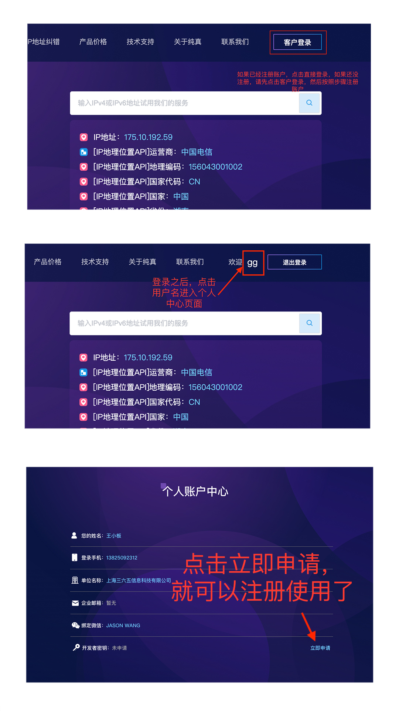
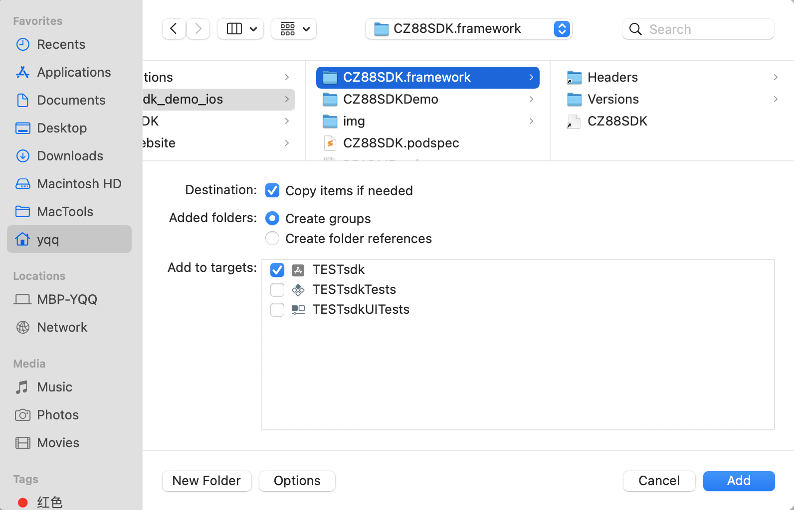
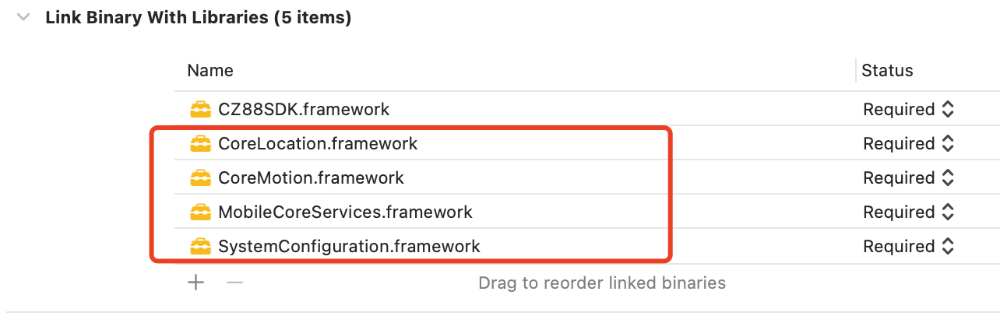

# IP定位SDK开发文档

## 接入流程：

### 1，申请APPKEY

#### step1: 前往纯真官网注册账户，并申请appKey

地址：https://www.cz88.net/

步骤如图示：1，注册并登录cz88.net  ->  进入个人中心  ->  申请appkey




### 2,接入SDK

#### 2.1 Cocoapods 自动集成(推荐)
Cocoapods集成可灵活配置所需SDK，如工程target名为CZ88SDKDemo，可选添下面的SDK，如在项目根目录的Podfile的格式：
````
target 'CZ88SDKDemo' do

  # Pods for CZ88SDKDemo
  pod 'CZ88SDK'

end

````
建议使用 pod update 命令进行直接更新。

#### 2.2 手动集成

1.下载CZ88SDK.framework到本地 。


2.Xcode `File` —> `Add Files to "Your Project"`，在弹出Panel选中所下载组件包CZ88SDK.framework－>Add。（注：选中“Copy items if needed”）




3.添加依赖库，在项目设置`target` -> 选项卡`Build Phases` ->`Linked Frameworks and Libraries`如下：




#### 2.3 在项目中使用

2.3.1 在您调用该SDK之前初始化该SDK，推荐在AppDelegate.m中完成


````
//导入头文件
#import <CZ88SDK/CZ88Header.h>


- (BOOL)application:(UIApplication *)application didFinishLaunchingWithOptions:(NSDictionary *)launchOptions {
    // Override point for customization after application launch.
   
    //初始化并注册appkey
    [[CZManager sharedInstance]registerCZ88Key:@"0c8e4b31-4fcc-3708-aea8-a94527a72ed3"];
    
    //是否开启日志
    [[CZManager sharedInstance]setLogEnabled:YES];

    return YES;
}

````

2.3.2 接下来，您就可以使用该SDK获取您的IP归属地了


````
 //调用代码得到ip 归属地
[[CZManager sharedInstance]cz88_readipdetailcompleted:^(CZIPModel * _Nullable result, NSError * _Nullable error) {
        if(!error){
            NSLog(@"成功 ip=>%@ 国家=>%@ 省=>%@ 城市=>%@ 运营商=>%@",result.ip,result.country,result.province,result.city,result.isp);


        }else{
            NSLog(@"错误%@",error);

        }
    }];

````

### ResponseData返回说明
#### 正确返回CZIPModel对象：

````
@interface CZIPModel : NSObject

@property (nonatomic ,copy) NSString *ip;//IP地址
@property (nonatomic ,copy) NSString *country;//IP地址归属国家
@property (nonatomic ,copy) NSString *province;//IP地址归属省份
@property (nonatomic ,copy) NSString *city;//IP地址归属城市
@property (nonatomic ,copy) NSString *districts;//IP地址归属区域
@property (nonatomic ,copy) NSString *isp;//IP地址所属运营商

@end

````

#### 返回异常：

````
{
    "code":5109,
    "msg":"appKey校验异常"
}
````

#### code说明：

|code|说明 | 
|:---|:---| 
| 200|  操作成功  | 
| 5001|请求参数校验异常|    
|5108| appKey当日查询额度用尽|
|5109|appKey校验异常|
|-1|操作异常|

#### code= -1 message说明

###### Invalid appkey 未设置APPKEY


#### 注意 在info添加如下配置

````
<application
        ...
        android:usesCleartextTraffic="true"
        ...>
       ...
    </application>

````


